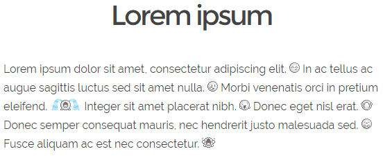
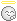
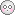
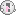
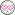
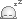
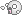
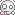

# 

Pixel Emotes is a pack of emoticons designed for use with text (of course!)
The pack currently includes 43 different emotes, all hand-pixelled and all really damn cute.

This pack contains a .yaml file for use with [Grav CMS](http://getgrav.org) - specifically, its Smileys plugin. To get my emotes to work right, you'll need to replace the following file:

    user/plugins/smileys/assets/smileys.css

...with the included .css file in my assets folder. All it does is remove the height limit for images.

If you wanna use it with anything else, go right ahead! (And drop me a message if you do use them, I'd love to see!)

# Preview

# Included emoticons

 - Base

 - 8B

 - Angelic

 - Angry

 - Blank Stare

 - Blush

 - Confused

 - Cool

 - Cute

 - Crying

 - Crazy

 - Devilish

 - Dummy

 - Evil

 - Greedy

 - Big Grin

 - Happy

 - Lovestruck

 - Hug

 - Irritated

 - o3o

 - Laughing

 - Lips Sealed

 - 8C

 - Rock On

 - Sad

 - REALLY Sad

 - Shocked

 - Sleepy

 - Smiling

 - ._.

 and  - Surprised

 - Terrified

 - Thumbs Down

 - Thumbs Up

 and  - Unsure

 - Wave

 - Wink

 - WRONG!

 - Zombie
